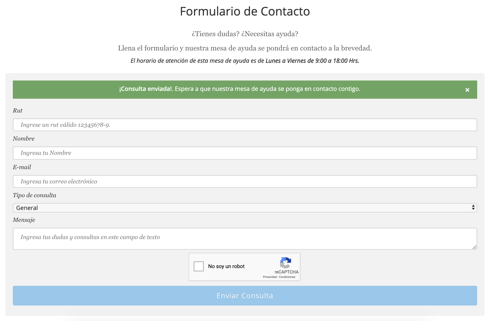

# EOL CONTACT FORM

New Page for Open Edx LMS (EOL) with a contact form

# Install

    docker-compose exec lms pip install -e /openedx/requirements/eol_contact_form

## Translation

**Install**

    docker run -it --rm -w /code -v $(pwd):/code python:3.8 bash
    pip install -r requirements.txt
    make create_translations_catalogs
    add your translation in .po files

**Compile**

    docker run -it --rm -w /code -v $(pwd):/code python:3.8 bash
    pip install -r requirements.txt
    make compile_translations

**Update**

    docker run -it --rm -w /code -v $(pwd):/code python:3.8 bash
    pip install -r requirements.txt
    make update_translations

# Configuration

To enable [Google ReCAPTCHA v2](https://www.google.com/recaptcha/) Edit *production.py* in *lms settings* and add your own keys. Add help desk default email.

    EOL_CONTACT_FORM_RECAPTCHA_SITE_KEY = AUTH_TOKENS.get('EOL_CONTACT_FORM_RECAPTCHA_SITE_KEY', '')
    EOL_CONTACT_FORM_RECAPTCHA_SECRET_KEY = AUTH_TOKENS.get('EOL_CONTACT_FORM_RECAPTCHA_SECRET_KEY', '')
    EOL_CONTACT_FORM_HELP_DESK_EMAIL = AUTH_TOKENS.get('EOL_CONTACT_FORM_HELP_DESK_EMAIL', '')

Set help desk email in a Site:
- */admin/site_configuration/siteconfiguration/*
    - **"EOL_CONTACT_FORM_HELP_DESK_EMAIL":""**

## TESTS
**Prepare tests:**

    > cd .github/
    > docker-compose run lms /openedx/requirements/eol_contact_form/.github/test.sh

# Screenshots
*Last Update 15/04/2020*

